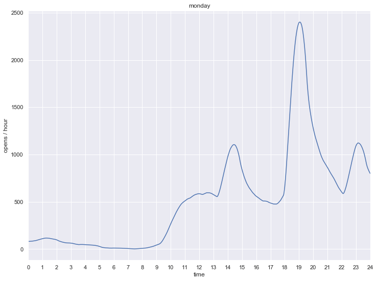
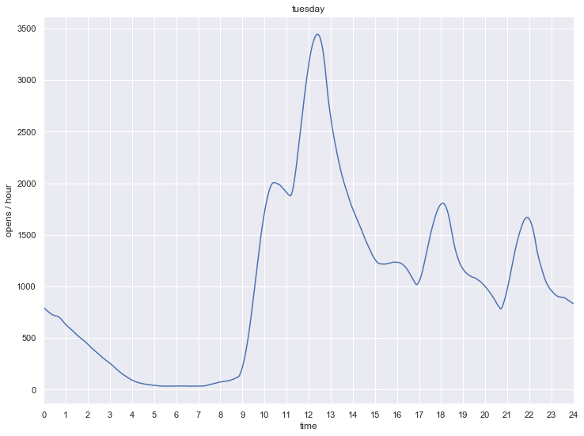
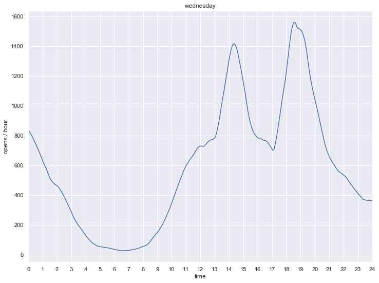
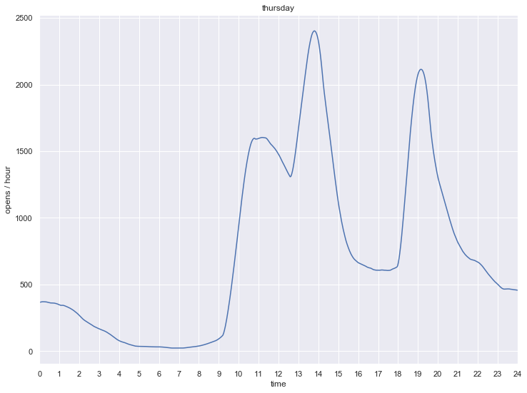
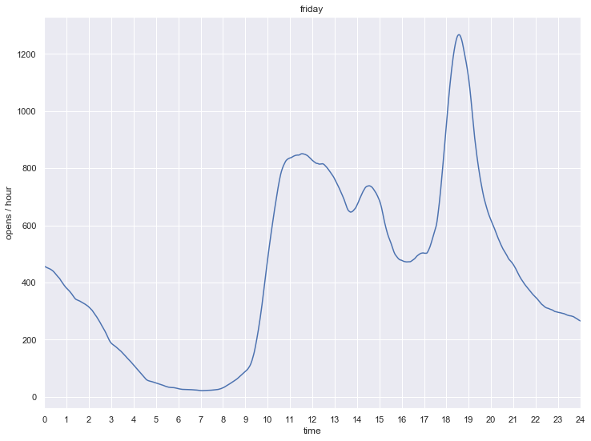
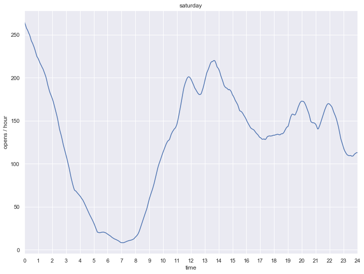
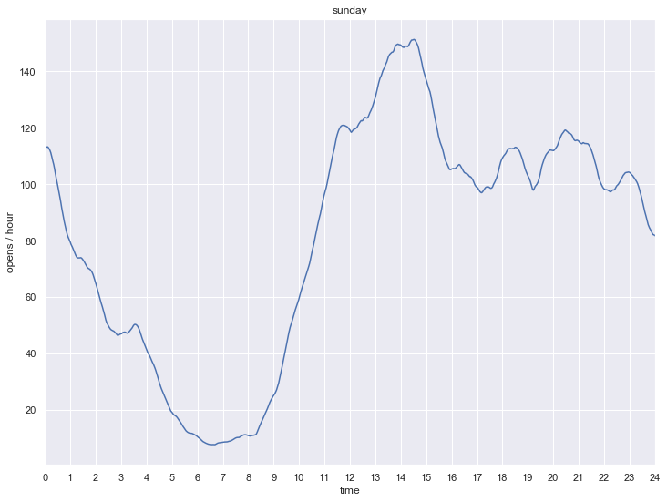

# Data Scientist: Dito
Susumu Asaga

##  SQL

1. **Qual o nome, email e telefone das 5 pessoas que mais geraram receita?**

A consulta SQL que resolve a pergunta é a seguinte:
```SQL
WITH top5 AS (
  SELECT id, SUM(properties.revenue) revenue
  FROM `dito-data-scientist-challenge.tracking.dito`
  WHERE type = 'track'
  GROUP BY id
  ORDER BY revenue DESC
  LIMIT 5
)
SELECT id, name, email, phone, revenue FROM(
  SELECT identify.id,
    FIRST_VALUE(identify.traits.name IGNORE NULLS) OVER (
      PARTITION BY identify.id
      ORDER BY identify.timestamp DESC
      ROWS BETWEEN UNBOUNDED PRECEDING AND UNBOUNDED FOLLOWING
    ) name,
    FIRST_VALUE(identify.traits.email IGNORE NULLS) OVER (
      PARTITION BY identify.id
      ORDER BY identify.timestamp DESC
      ROWS BETWEEN UNBOUNDED PRECEDING AND UNBOUNDED FOLLOWING
    ) email,
    FIRST_VALUE(identify.traits.phone IGNORE NULLS) OVER (
      PARTITION BY identify.id
      ORDER BY identify.timestamp DESC
      ROWS BETWEEN UNBOUNDED PRECEDING AND UNBOUNDED FOLLOWING
    ) phone,
    revenue
  FROM `dito-data-scientist-challenge.tracking.dito` identify, top5
  WHERE identify.type = 'identify' AND identify.id = top5.id
)
GROUP BY id, name, email, phone, revenue
ORDER BY revenue DESC
```
e a resposta à pergunta é a seguinte:

Row	| id | name	| email	| phone	| revenue
--- | --- | --- | --- | --- | ---
1 | f56861d3-a2b5-4ab0-b0ef-6ce2005f84dd | Heloísa Ordonhes | joshua_prosacco@gmail.com | (51) 91972-9639 | 4,850.27
2 | bea16033-7519-4520-a2ba-0425174d397b | Mirella Soares | velia.pagac@hotmail.com | (43) 97290-9288 | 4,433.44
3 | 9e505eb0-e3f2-4715-a1e9-e05605022a95 | Fernanda Resende | charlott.ledner@live.com | (33) 92311-0450 | 4,289.69
4 | 99ab1cee-2645-4ae3-8ffe-f28508666098 | Sophie Banheira | fransisca.predovic@bol.com.br | (24) 91404-3805 | 4,261.43
5 | fc3650a4-3f19-4047-9354-65e2a23a4a40 | Alícia Pinheira | bill@bol.com.br | (51) 91012-4779 | 4,260.19

A primeira sub-consulta `top5` é a consulta principal onde encontramos os `id`s das 5 pessoas que mais geraram receita.

Na sub-consulta mais interna é feito um `join` entre eventos de `identify` e a sub-consulta `top5` e usamos a função analítica `FIRST_VALUE` para obter a informação mais atualizada de `name`, `email` e `phone` da pessoa.

Na sub-consulta mais externa agrupamos as linhas por pessoa e ordenamos por `revenue` descendente.

2. **De quantos em quantos dias, em média, as pessoas compram? Use a mediana como média.**

A consulta SQL que resolve a pergunta é a seguinte:
```SQL
SELECT PERCENTILE_CONT(
  TIMESTAMP_DIFF(timestamp, last_timestamp, SECOND) / 86400,
  0.5
) OVER() median_days
FROM (
  SELECT id,
    timestamp,
    LAG(timestamp) OVER (
      PARTITION BY id
      ORDER BY timestamp
    ) last_timestamp
  FROM `dito-data-scientist-challenge.tracking.dito`
  WHERE type = 'track'
)
LIMIT 1
```
A resposta da consulta é que as pessoas compram em média a cada 0.221 dias.

A sub-consulta recupera para cada compra o `id` do comprador, o `timestamp`, e o `timestamp` da sua compra anterior ou `NULL` se for sua primeira compra, para isso usa a função analítica `LAG`.

A consulta principal calcula o intervalo em dias entre duas compras sucessivas usando a função `TIMESTAMP_DIFF` e a mediana de todas as linhas por meio da função analítica `PERCENTILE_CONT`.

## Send Time Optimization

Todos são diferentes e todos têm horários diferentes, mas podem se agrupar ao redor de poucas horas específicas diferentes do dia, especialmente se estăo no mesmo fuso horário, pois a maioria trabalha de dia e dorme de noite. Então a primeira coisa que vamos fazer é processar os dados e descobrir quais são esses grupos de horas e depois encontrar qual é o grupo preferencial de cada usuário para enviar e-mail, respeitando o direito daqueles que não desejam receber as nossas mensagens. Para isso a técnica de ciência de dados que usaremos é a aprendizagem não supervisionada de análise de cluster.

Além do ciclo diário existe também o ciclo semanal, assim os hábitos dos usuários no fim de semana devem ser diferentes dos hábitos no meio da semana ou da segunda-feira, assim  devemos considerar não só a hora onde os eventos de abertura ocorrem, mas também em que dia da semana aconteceu.

### Análise de cluster

Para fazer a análise de cluster, consideraremos apenas a hora e o dia da semana dos eventos `open` e  abstraíremos os demais eventos, bem como o `id`, `email_id`, o dia, mês, e ano. Quando dois eventos `open` ocorrerem com intervalo inferior a 1 segundo, consideramos como se tivesse ocorrido apenas um.

Assim temos apenas 1 dimensăo a considerar: quando o `open` ocorreu durante a semana. Podemos analisar os dados usando a técnica de Kernel Density Estimation (KDE).

As estimativas de densidade estão intimamente relacionadas com histogramas, mas são dotadas com propriedades como suavidade e continuidade usando um kernel e largura de banda adequadas. Adotamos o kernel de Epanechnikov e o valor de 1 hora para largura de banda. A largura de banda foi escolhida varrendo-se uma série de 25 valores por década e escolhendo o menor valor possível que visualmente fosse suave, sem exagerar e perder características marcantes da distribuição.

Esperamos um aumento no open rate enviando a mensagem um ceto tempo antes, digamos 30 minutos, de um máximo local da densidade estimada pelo KDE.

Para facilitar a análise elaboraremos o KDE para cada dia da semana separadamente. Para assegurar a acurácia no início e fim do dia, incluímos os dados de uma margem de segurança de 1:15 antes da zero hora e depois das 24 horas.

Para realizar o KDE usamos Scikit-Learn por causa de sua eficiência e flexibilidade. O procedimento usado está detalhado [neste texto](kde.md).

 Como os horários estão na fuso GMT, para obter a hora local, devemos subtrair 3 horas, por exemplo 12:00 corresponde às 09:00 do horário local. Trabalharemos no fuso GMT, sem conversão para o fuso horário local.

Percebemos que o horário de verão brasileiro a partir de 04/11/2018, não alterou significativamente o padrão de acesso, assim não fizemos nenhum ajuste a fim de considerar o horário de verão.

Nas próximas seções, analisaremos os resultados do KDE para cada dia da semana.

#### Segunda-feira

Para segunda-feira, tivemos 13.615 `open`s.

O KDE de segunda-feira é o do seguinte gráfico.



#### Terça-feira

Para terça-feira, tivemos 27.213 `open`s, mais de 2 vezes o número de segunda-feira. É o dia da semana em que tivemos maior número de `open`s.

O KDE de terça-feira é o do seguinte gráfico.



#### Quarta-feira

Para quarta-feira, tivemos 15.780 `open`s. É o 3º dia da semana com mais `open`s.

O KDE de quarta-feira é o do seguinte gráfico.



#### Quinta-feira

Para quinta-feira, tivemos 18.924 `open`s, o 2º dia da semana com mais `open`s.

O KDE de quinta-feira é o do seguinte gráfico.



#### Sexta-feira

Para sexta-feira, tivemos 11.419 `open`s.

O KDE de sexta-feira é o do seguinte gráfico.



#### Sábado

Para sábado, tivemos 3.544 `open`s.

O KDE de sábado é o do seguinte gráfico.



#### Domingo

Para domingo, tivemos 2.197 `open`s, o menor número da semana.

O KDE de domingo é o do seguinte gráfico.



#### Top Clusters

Ao todo, tivemos 85.505 `open`s, o que dá uma densidade média de 509 `open`s por hora. Para envio de e-mail, escolhemos aqueles clusters com pico acima de 1000 `open`s por hora e fixamos a hora de envio aproximadamente meia-hora antes da hora de pico. Dessa forma, construímos a tabela abaixo por ordem descente de densidade de `open`s.

Rank |Dia  | Hora de pico  | Hora de envio | Hora local 
---: | --- | ---:     | ---:     | ---:
1  | Terça-feira   | 12:27 | 12:00 |  9:00
2  | Quinta-feira  | 13:50 | 13:15 | 10:15
3  | Segunda-feira | 19:07 | 18:30 | 15:30
4  | Quinta-feira  | 19:13 | 18:45 | 15:45
5  | Terça-feira   | 10:35 | 10:00 |  7:00
6  | Terça-feira   | 18:05 | 17:30 | 14:30
7  | Terça-feira   | 21:55 | 21:30 | 18:30
8  | Quinta-feira  | 10:58 | 10:30 |  7:30
9  | Quarta-feira  | 18:40 | 18:15 | 15:15
10 | Quarta-feira  | 14:25 | 14:00 | 11:00
11 | Sexta-feira   | 18:37 | 18:00 | 15:00
12 | Terça-feira   | 15:55 | 15:30 | 12:30
13 | Segunda-feira | 23:18 | 22:45 | 19:45
14 | Segunda-feira | 14:29 | 14:00 | 11:00

Serão considerados como pertencentes ao cluster as `action`s de `open` que ocorrerem até 2 horas após a hora de envio do e-mail. 

### Classificação dos recebedores

Para cada recebedor será atribuido um dia e uma hora de envio pertencente à tabela acima. O cluster escolhido será aquele quando houver maior número de `action`s `open` pelo recebedor. Em caso de empate, será escolhido o cluster que estiver mais perto do topo da tabela. O dia de envio será indicado por um inteiro de 1 a 7, sendo 1 para o domingo e 7 para o sábado. A hora de envio será indicada por uma `string` no formato HH:MM com HH entre 00 e 23, para o fuso horário de Greenwich. 

Se houver alguma `action` `unsubscribe` ou `spamreport`, isso será sinalizado por -1 no campo `send day` na tabela de recebedores.

Caso nenhuma `action` `open` do recebedor puder ser encaixada em um dos clusters, esse fato será sinalizado com 0 no campo `send day` na tabela de recebedores. Nesse caso podemos fazer testes de enviar e-mails para o recebedor nos dias e horas de cada um dos clusters e reavaliar os resultados.

A classificação dos recebedores é feita pela manipulação de Pandas `DataFrame`s e está descrito [neste texto](classify_recipients.md). Os resultados estão gravados no arquivo [recipients.csv](recipients.csv).